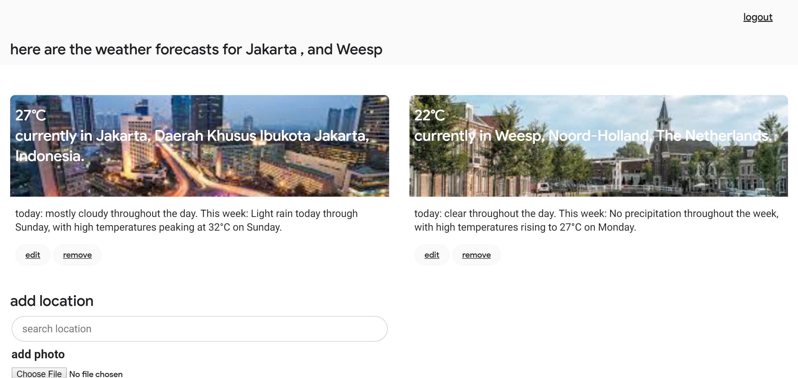
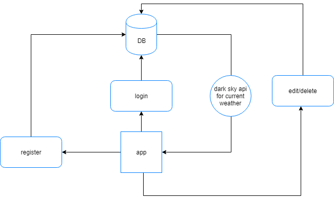

# weather app
## [link to app(app)](https://warm-meadow-46174.herokuapp.com/)



## About
This is the repo for assestment 2, back end 2018. With this app users will be able to log in and save locations and get the weather for each of them. The users and their chosen location are stored in a database, and everytime a user logs in he will see their weather predictions of their locations. Users can the edit and remove their locations.

## Features
With this app users can search for a place and get the weather, using the [Dark Sky API(Dark Sky)](https://darksky.net/dev). When a user registers, he can add a location with a photo. This location and the user is stored in a mongo database, so each user has their own account with locations. The user can add new locations and see them all on the homepage. Every location can be edited and new photos can be changed for every one of them. Place searching is done with [Algolia(algolia)](https://community.algolia.com/places/).

The app is made with node.js, with a few clientside javascript enhancements.

## Flow of the app


### Tools
This is a nodejs app using express. MongoDB is used for storing users and locations. The app is using data from Dark Sky API. Below are the packages I use:
```
    "body-parser": "^1.17.2",
    "compression": "^1.6.2",
    "connect-flash": "^0.1.1",
    "dotenv": "^4.0.0",
    "ejs": "^2.5.6",
    "express": "^4.15.2",
    "express-session": "^1.15.3",
    "jimp": "^0.2.28",
    "mongoose": "4.10.6",
    "multer": "^1.3.0",
    "nodemon": "^1.11.0",
    "passport": "^0.4.0",
    "passport-local-mongoose": "^5.0.1",
    "querystring": "~0.2.0",
    "request-promise": "^4.2.1",
    "uuid": "^3.3.0"
```

## Install the app
To see it live and go trough the Oauth flow your self clone this repo, run the following command in the terminal
```
git clone
```

From the root of the directory run
```
npm install
```

Then add these to the server.js file in the root of the project. You can get dark sky api keys [here (ds)](https://darksky.net/dev). 
```
PORT=9999
DS_KEY=f326d75591330148a6021024442d7830
SEARCH_KEY=5b7bee1f9de1018c24f766cfe6ef715e
mongo=mongodb://<username>:<password>@ds163730.mlab.com:63730/<db-name>

```
Then
```
npm start
```

Now you can see the app for your self and test it out.
